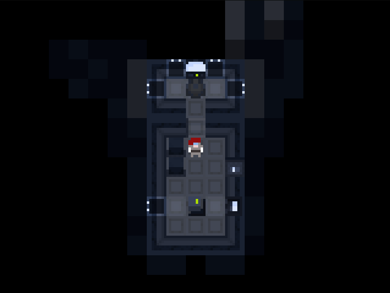

space
=====

This little game startet out as a means to learn Rust. Keeping things simple has proven to be very engaging and productive. Although there might the occasional small commit out of line :smiley face:

A good start → [The Rust Programming Language](https://doc.rust-lang.org/book/second-edition/index.html "The Rust Programming Language")

The game framework in use → [ggez](http://ggez.rs/ "ggez game framework")

Currently the engine is reworked to use [specs](https://slide-rs.github.io/specs/ "entity component system") as an entity component system for all the things.

setup
-----

developed on linux. on windows you need to place the sdl2 library in the project root. read [here](https://github.com/ggez/ggez/blob/master/docs/FAQ.md#how-do-i-build-on-platform-x "ggez game framework") for more information.

* clone this
* install rust (using rustup is recommended)
* run `cargo run` to compile and run the game
* levels are loaded statically from functions
* current state is stored in saves/auto-save.tar

and here is what you can do
---------------------------

* move around with `↑`,`→`,`↓` and `←`
* interact with `Return`
* items can be moved with `Tab`
* inventory `i`
* map `m` (when equiped with a *Navcomp*)

what it looks like right now
----------------------------

*Onboard a simple ship. There are storages next to the player character, the main ship console on the front and the exit on the right. The generator powers the circuitry from the back of the ship.*
